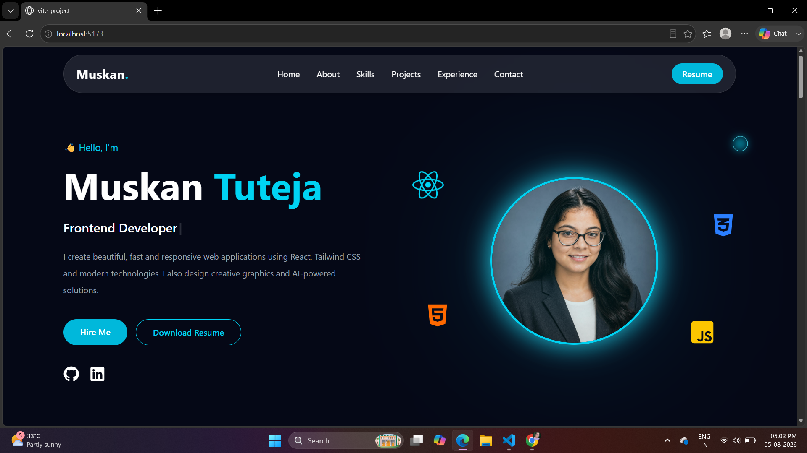

# 💼 Muskan Tuteja Portfolio

A modern and responsive personal portfolio built using **React**, **Vite**, **Tailwind CSS**, and **Framer Motion**. It showcases my skills, projects, experience, and provides an easy way to connect with me.

## 🌐 Live Demo

👉 https://my-portfolio-muskan-30c0.vercel.app/

---

## 🚀 Features

- ✨ Modern UI Design
- 📱 Fully Responsive
- ⚡ Fast Performance with Vite
- 🎨 Tailwind CSS Styling
- 🎥 Smooth Animations using Framer Motion
- 🌟 Animated Background
- 💎 Glassmorphism Design
- 🖱️ Custom Cursor
- 💼 Projects Showcase
- 📊 Skills Section
- 📄 Resume Download
- 📧 Contact Form

---

## 🛠️ Tech Stack

- React.js
- Vite
- Tailwind CSS
- Framer Motion
- React Icons
- FormSubmit

---

## 📂 Folder Structure

```bash
src/
 ├── components/
 ├── assets/
 ├── App.jsx
 ├── main.jsx
 └── index.css
```

---

## ⚙️ Installation

Clone the repository

```bash
git clone https://github.com/Muskan-tuteja/My-Portfolio.git
```

Go to project folder

```bash
cd My-Portfolio
```

Install dependencies

```bash
npm install
```

Run locally

```bash
npm run dev
```

Build project

```bash
npm run build
```

---

## 📸 Portfolio Preview



---

## 👩‍💻 About Me

I'm **Muskan Tuteja**, a Frontend Developer passionate about building responsive and user-friendly web applications using React and modern web technologies. I enjoy creating clean UI designs and continuously improving my development skills by working on real-world projects.

---

## 📫 Contact

📧 Email: **muskantuteja714@gmail.com**

💼 LinkedIn:
https://www.linkedin.com/in/muskan-90b1b2322

🐙 GitHub:
https://github.com/Muskan-tuteja

🌍 Portfolio:
https://my-portfolio-muskan-30c0.vercel.app/

---

## ⭐ Support

If you like this project, don't forget to ⭐ the repository.